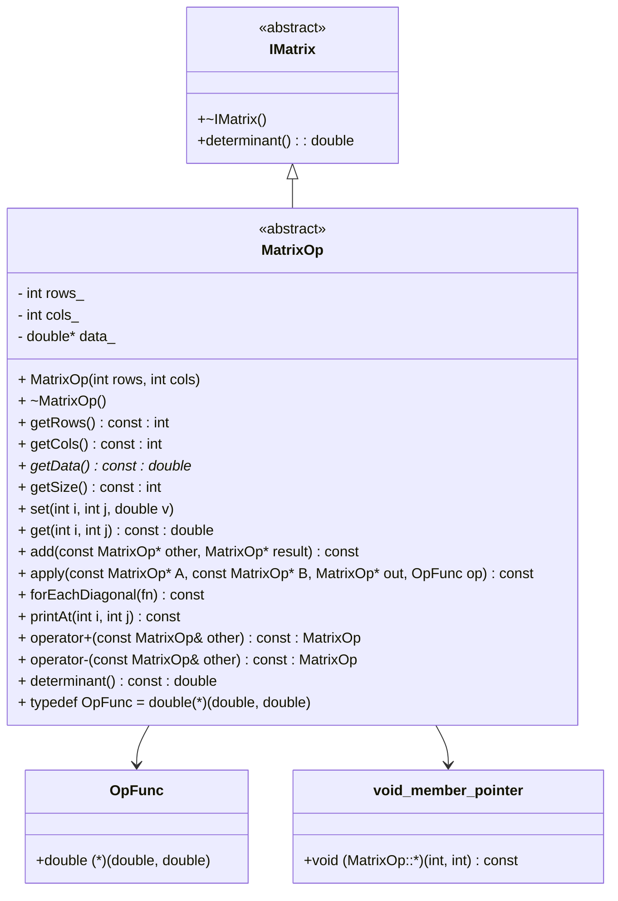

# Plantilla C++ Profesional

Repositorio plantilla para iniciar proyectos en C++ con estilo y estructura estandarizada.

```mermaid
classDiagram
    class IMatrix {
        <<abstract>>
        +~IMatrix()
        +determinant() : double
    }

    class MatrixOp {
        <<abstract>>
        - int rows_
        - int cols_
        - double* data_
        + MatrixOp(int rows, int cols)
        + ~MatrixOp()
        + getRows() const : int
        + getCols() const : int
        + getData() const : double*
        + getSize() const : int
        + set(int i, int j, double v)
        + get(int i, int j) const : double
        + add(const MatrixOp* other, MatrixOp* result) const
        + apply(const MatrixOp* A, const MatrixOp* B, MatrixOp* out, OpFunc op) const
        + forEachDiagonal(fn) const
        + printAt(int i, int j) const
        + operator+(const MatrixOp& other) const : MatrixOp
        + operator-(const MatrixOp& other) const : MatrixOp
        + determinant() const : double
        + typedef OpFunc = double(*)(double, double)
    }

    IMatrix <|-- MatrixOp

    %% Relaciones de uso (punteros a función y miembro)
    MatrixOp --> OpFunc
    MatrixOp --> void_member_pointer

    class OpFunc {
        +double (*)(double, double)
    }

    class void_member_pointer {
        +void (MatrixOp::*)(int, int) const
    }
```