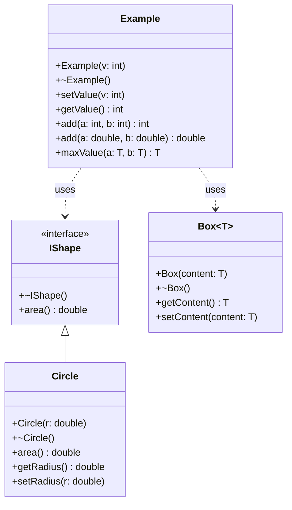

# Arquitectura del Proyecto

Descripción de la arquitectura.

```mermaid
classDiagram
    %% Interfaces y clases
    class IShape {
        <<interface>>
        +~IShape()
        +area() double
    }
    class Circle {
        +Circle(r: double)
        +~Circle()
        +area() double
        +getRadius() double
        +setRadius(r: double)
    }
    class Example {
        +Example(v: int)
        +~Example()
        +setValue(v: int)
        +getValue() int
        +add(a: int, b: int) int
        +add(a: double, b: double) double
        +maxValue<T>(a: T, b: T) T
    }
    class Box~T~ {
        +Box(content: T)
        +~Box()
        +getContent() T
        +setContent(content: T)
    }

    %% Relaciones
    IShape <|-- Circle
    Example ..> IShape : uses
    Example ..> Box~T~ : uses
```